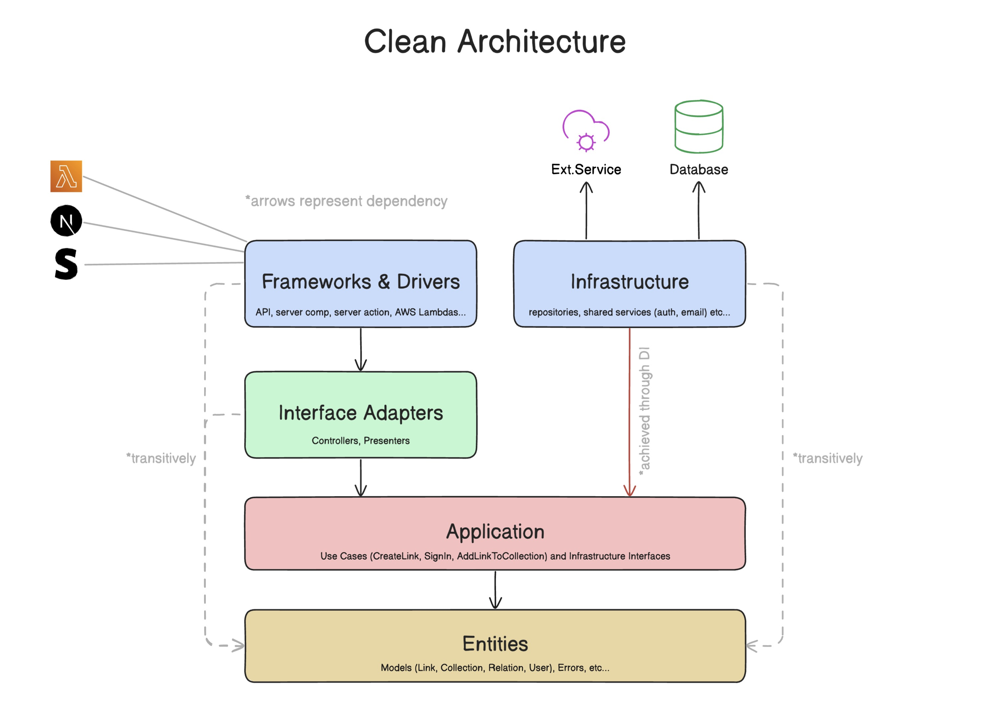

# Clean Architecture on NextJs

This project is a web-based University Information System built with Next.js, following a simplified implementation of Clean Architecture principles. It allows teachers to post announcements, guests to access public announcements, and provides personalized "For You" sections for students based on their enrolled classes, extracurricular activities, or clubs. The system emphasizes separation of concerns for better maintainability, testability, and independence from external frameworks or databases.

## Project Overview

The University Information System (UIS) is designed to streamline communication within a university environment:

- **Announcements Management**: Teachers and authorized users can create, edit, and post announcements tied to specific classes, clubs, or extracurricular activities.
- **Public Access**: Guests (non-authenticated users) can view common or public announcements without logging in.
- **Personalized "For You" Section**: Authenticated students see tailored announcements from professors or groups they are associated with (e.g., enrolled classes or joined clubs). This is achieved through user-domain memberships.
- **User Roles**: Supports roles like "student" and "teacher" (with potential for "admin"), handling authentication, authorization, and user-specific features.
- **Core Entities**: Includes users, posts (announcements), domains (representing classes/clubs/extracurriculars), and memberships linking users to domains.

The system uses a clean, layered architecture to keep business logic isolated from UI and infrastructure concerns, making it easier to test, refactor, or switch technologies (e.g., change databases without affecting core logic).

## Features

- User authentication (sign-up, sign-in, sign-out) with email/password.
- Role-based access: Teachers post announcements; students view personalized feeds.
- Announcement posting and viewing, categorized by domains (classes/clubs).
- Public vs. private announcements based on user memberships.
- Rich text editing for announcements (via Tiptap).
- Monitoring and error handling for robust operations.
- Database transactions for reliable data operations.

## Clean Architecture Explanation

Clean Architecture is a software design philosophy introduced by Robert C. Martin (Uncle Bob) that promotes separation of concerns to create systems that are independent of frameworks, databases, and UI technologies. The goal is to make the core business logic testable, maintainable, and adaptable. It achieves this through concentric layers where dependencies flow inward: outer layers depend on inner ones, but not vice versa. This enforces a "dependency rule" and uses principles like Dependency Inversion and Injection to decouple implementations.



In this project, i've implemented a simplified version of Clean Architecture inspired by (https://github.com/nikolovlazar). The core business rules (e.g., user authentication, announcement posting) are isolated from Next.js (UI/framework) and PostgreSQL (database), allowing for easy testing and potential swaps (e.g., to a different auth provider). Dependency Injection (via `@evyweb/ioctopus`) wires up layers without tight coupling.

### Layer-by-Layer Explanation

1. **Entities Layer** (`src/entities`):

   - Defines the core domain models (e.g., `User`, `Post`, `Domain`), validation schemas (using Zod), enums (e.g., `ACCOUNT_ROLE`), and custom errors (e.g., `DatabaseOperationError`, `InputParseError`).
   - These are plain JavaScript/TypeScript objects, independent of any framework or database.
   - Dependencies: None (innermost layer).
   - Role in Project: Provides the foundation for all data shapes and rules, ensuring enterprise business rules (e.g., password length) are enforced universally.

2. **Application Layer** (`src/application`):

   - Contains business logic: Use Cases (e.g., `signInUseCase` for login operations), interfaces for Repositories (e.g., `IUsersRepository` for data access), and Services (e.g., `IAuthenticationService` for auth operations).
   - Use Cases orchestrate operations, perform authorization, and call interfaces without knowing implementations.
   - Dependencies: Only on Entities.
   - Role in Project: Houses the application's core rules, like signing in a user or fetching domain memberships, making it fully testable in isolation.

3. **Infrastructure Layer** (`src/infrastructure`):

   - Implements the interfaces from the Application layer, handling real-world concerns like database queries (using Knex and PG) or external services (e.g., Better Auth integration).
   - Examples: Concrete repositories like `DomainsMembershipSQLRepositories` for SQL operations.
   - Dependencies: On Application (interfaces) and Entities.
   - Role in Project: Connects to PostgreSQL for persistence, ensuring the core remains unaware of DB specifics.

4. **Interface-Adapters Layer** (`src/interface-adapter`):

   - Bridges the core to the outer world with Controllers (e.g., `signInController` for input validation and Use Case orchestration) and Presenters (for formatting responses).
   - Handles input parsing (Zod), error bubbling, and UI-friendly data conversion.
   - Dependencies: On Application and Entities.
   - Role in Project: Serves as entry points for Next.js routes, validating requests before passing to Use Cases.

5. **Frameworks & Drivers Layer** (`src/app`):

   - Manages Next.js-specific elements: pages, routing (standard file-based), server actions, and components.
   - Invokes controllers but contains no business logic.
   - Dependencies: On Interface-Adapters and Components.
   - Role in Project: Renders UI and handles user interactions, keeping the framework isolated.

6. **Components Layer** (`src/components`):

   - Reusable UI elements using Material-UI and React, including forms and rich editors (Tiptap).
   - Dependencies: Minimal, used by Frameworks layer.
   - Role in Project: Builds the visual interface, with state via Jotai.

7. **Dependency Injection Layer** (`DI`):

   - Configures the IoC container, binding interfaces to implementations via modules (e.g., `createAuthenticationModule`).
   - Uses symbols (e.g., `DI_SYMBOLS.IAuthenticationServices`) for resolution.
   - Dependencies: Spans layers but enforces inversion.
   - Role in Project: Enables loose coupling, allowing injection of services/use cases without direct imports.

## Authentication with Better Auth

This project uses [Better Auth](https://better-auth.com/) for secure email/password authentication, integrated via the Infrastructure layer to keep it decoupled from the core. Key files:

- **src/lib/auth.ts**: Server-side configuration. Initializes Better Auth with PostgreSQL connection (`pg_pool`), enables email/password auth without requiring email verification, and uses Next.js cookies plugin for session management.

  ```typescript
  import { pg_pool } from "@/infrastructure/config/pg_pool";
  import { betterAuth } from "better-auth";
  import { nextCookies } from "better-auth/next-js";

  export const auth = betterAuth({
    database: pg_pool,
    emailAndPassword: {
      enabled: true,
      requireEmailVerification: false,
    },
    plugins: [nextCookies()],
  });
  ```

- **src/lib/auth-client.ts**: Client-side hooks for React integration, providing functions like `signIn`, `signOut`, `signUp`, and `useSession`.
  ```typescript
  import { createAuthClient } from "better-auth/react";
  export const { signIn, signOut, signUp, useSession } = createAuthClient({
    baseURL: "http://localhost:3000",
  });
  ```

This setup ensures authentication is handled securely, with sessions stored in cookies, and integrates seamlessly with the Clean Architecture (e.g., via `IAuthenticationService` interface).

## Project Structure

```
DI/                  # Dependency Injection setup and modules
src/
  app/               # Next.js pages, routing, server actions (Frameworks layer)
  application/       # Business logic: use cases, repo/service interfaces
    repositories/    # Repository interfaces
    services/        # Service interfaces
    usecases/        # Use case functions
  components/        # Reusable UI components (e.g., forms, editors)
  entities/          # Models, schemas, enums, custom errors
  infrastructure/    # Repo/service implementations, DB ops
  interface-adapter/ # Controllers and presenters
  lib/               # Utilities like auth configuration
test/                # E2E and integration tests
docker-compose.yml   # Docker setup for Postgres
.env.example         # Template for environment variables
package.json         # Dependencies
table.sql            # Initial database schema
```

## Technologies Used

- **Framework**: Next.js (v15.4.4) for server-side rendering, routing, and API routes.
- **UI Libraries**: React (v19.1.0), Material-UI (MUI) for components and icons, Tiptap for rich text editing.
- **State Management**: Jotai for global state.
- **Authentication**: Better-Auth for email/password handling.
- **Database**: PostgreSQL (via Docker), Knex for queries/migrations, PG driver.
- **Validation**: Zod for schema validation in models and inputs.
- **Dependency Injection**: @evyweb/ioctopus for IoC container.
- **Monitoring**: Sentry for error tracking and instrumentation.
- **Forms**: React Hook Form with Zod resolvers.
- **Testing**: Jest for integration, Playwright for E2E, Supertest for API tests.
- **Other**: Dayjs for dates, Faker for testing data, Dotenv for env vars.

Docker is used to spin up a PostgreSQL instance with initial schema from `table.sql`.

## Setup Instructions

1. **Prerequisites**:

   - Node.js (v20+)
   - Docker and Docker Compose (for PostgreSQL)
   - Yarn or npm

2. **Clone the Repository**:

   ```
   git clone https://github.com/kennylisal/next-clean-architecture.git
   ```

3. **Install Dependencies**:

   ```
   npm install
   ```

4. **Set Up Environment**:

   - Copy the provided `.env.example` file to `.env` in the root directory:
     ```
     cp .env.example .env
     ```
   - Edit `.env` and fill in the required values for each variable. Never commit your `.env` file to version control, as it contains sensitive information like passwords and secrets.
   - **Variable Explanations**:
     - `DATABASE_HOST`: The hostname of your PostgreSQL database (default: `127.0.0.1` for local Docker).
     - `DATABASE_PORT`: The port for the PostgreSQL connection (default: `5432`).
     - `DATABASE_USER`: The username for the database (default: `postgres` for the Docker setup).
     - `DATABASE_PASSWORD`: The password for the database user (default: `password` for the Docker setup).
     - `DATABASE_NAME`: The name of the database (default: `sim_db`).
     - `BASE_URL`: The base URL of your application (default: `http://localhost:3000` for development).
     - `BETTER_AUTH_SECRET`: A secret key for Better Auth (generate a strong, random string, e.g., using `openssl rand -base64 32`).
     - `BETTER_AUTH_URL`: The URL where Better Auth is hosted (default: `http://localhost:3000`).
     - `SENTRY_DSN`: The Sentry Data Source Name for error monitoring (obtain from your Sentry project dashboard; optional if not using Sentry).
   - These variables are used to configure database connections (via Knex/PG), authentication (Better Auth), and monitoring (Sentry). The database variables can be used to construct the `DATABASE_URL` if needed in other parts of the app.

5. **Run PostgreSQL with Docker**:

   - Ensure Docker is running.
   - Start the PostgreSQL service using the provided `docker-compose.yml`:
     ```
     docker-compose up -d
     ```
     This command:
     - Pulls the latest PostgreSQL image.
     - Starts a container named `postgres-clean-container`.
     - Sets up the database `sim_db` with user `postgres` and password `password`.
     - Maps port `5432` on your machine to the container.
     - Executes `table.sql` from the `./table.sql` file to initialize the database schema.

6. **Verify Database**:

   - Confirm the PostgreSQL container is running:
     ```
     docker ps
     ```
   - Optionally, connect to the database to verify:
     ```
     docker exec -it postgres-clean-container psql -U postgres -d sim_db
     ```

7. **Run Development Server**:

   ```
   npm run dev
   ```

   Access the application at `http://localhost:3000`.

8. **Build and Start Production**:

   ```
   npm run build
   npm start
   ```

9. **Testing**:

   ```
   npm test
   ```

## Usage

- **Sign Up/Sign In**: Use forms to create accounts (student/teacher roles).
- **Post Announcements**: Teachers can create posts tied to domains (classes/clubs).
- **View Feeds**: Students see "For You" based on memberships; guests see public ones.
- Routes follow Next.js standards (e.g., `/announcements` for listings).

## Testing Documentation

Testing is located in the `test/` folder at the root, focusing on two main types: End-to-End (E2E) and Integration tests. These ensure the system's reliability, from user flows to backend interactions. Tests use Playwright for E2E (browser automation) and Jest for Integration (unit-like checks on services/repositories). Faker.js generates mock data, and Knex handles DB setup/teardown.

### E2E Tests (`test/e2e/`)

These simulate real user interactions in a browser, verifying full flows like authentication and route protection. Here are a few example that exist from e2e testing:

- **auth-flow.better-auth.test.ts**: Tests authentication workflows.
  - **Prevent access to protected route when not logged in**: Ensures unauthenticated users are redirected from protected pages (e.g., `/posts`) to login.
  - **Perform login and redirected to /posts**: Simulates filling login form with mock credentials and confirms redirection to protected route after successful login.

Run with: `npx playwright test`.

### Integration Tests (`test/integration/`)

These test backend components in isolation or with DB connections, focusing on services and repositories. They follow an Arrange-Act-Assert structure: prepare data, execute the action, and verify results. DB is truncated before/after tests for isolation. Here are a few example from integration testing:

- **better-auth.authentication.services.test.ts**: Verifies Better Auth integration.
  - Checks DB connection.
  - Tests user sign-up (creates user with mock email/password, expects user ID string).
  - (Commented: sign-in test for future expansion).
- **domain-membership.psql.integration.test.ts**: Tests domain membership repository operations with PostgreSQL.
  - Setup: Inserts mock domains and memberships (e.g., 4 members in domain 2020, 3 in 2021).
  - Tests: DB connection, inserting memberships, getting member counts, fetching statuses by IDs, and retrieving all user memberships.
  - Teardown: Truncates tables.

Run with: `npm test` or `jest`.

These tests cover critical paths, with room for expansion (e.g., more use case tests). Aim for high coverage on repositories and services.

## Credits

- This project's Clean Architecture implementation is heavily inspired by [nikolovlazar/nextjs-clean-architecture](https://github.com/nikolovlazar/nextjs-clean-architecture/tree/main?tab=readme-ov-file).
- Core concepts from Uncle Bob's article: [The Clean Architecture](https://blog.cleancoder.com/uncle-bob/2012/08/13/the-clean-architecture.html).
- UI template provided by [pbasiak/dev-fox-ui-mui-dashboard-theme](https://github.com/pbasiak/dev-fox-ui-mui-dashboard-theme).
